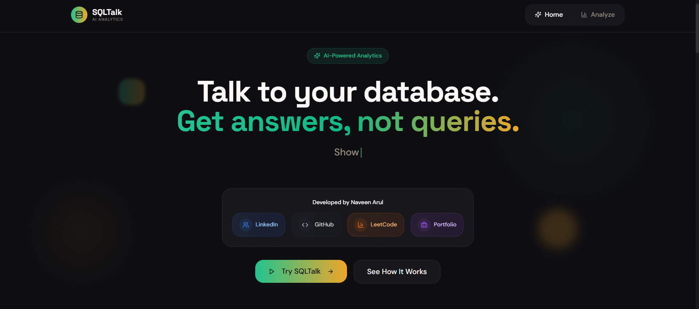

# SQLTalk - AI-Powered Database Analytics

A full-stack application that allows users to query databases using natural language, with the AI generating SQL queries and returning results with visualizations. SQLTalk bridges the gap between business users and data by enabling anyone to get insights from their data without SQL knowledge.

## Live Demo

Check out the live application: [https://sql-talk.vercel.app/](https://sql-talk.vercel.app/)

## Application Screenshot



## Key Features

- Natural language to SQL conversion
- Real-time query results
- Interactive data visualizations
- Export capabilities (CSV, Excel, PDF)
- Secure SQL validation
- User-friendly interface
- Read-only operations for safety
- Instant dashboard generation
- Multi-table support
- Advanced filtering options

## Technology Stack

### Frontend
- **Framework**: React with TypeScript
- **Build Tool**: Vite
- **Styling**: Tailwind CSS with Shadcn UI components
- **State Management**: React hooks
- **API Communication**: Axios
- **Charts & Visualizations**: Recharts

### Backend
- **Runtime**: Node.js
- **Framework**: Express.js
- **Database**: PostgreSQL
- **AI Integration**: Groq API for natural language processing
- **Security**: Multi-layered SQL validation

### Architecture

```
User Input (Natural Language)
         ↓
Frontend Query Component
         ↓
Backend API (/api/analyze)
         ↓
NLP Service (AI Processing)
         ↓
SQL Generation Service
         ↓
SQL Validation Layer
         ↓
Database Query Execution
         ↓
Results Processing
         ↓
Frontend Visualization
```

## Security Architecture

The application implements multiple security layers to protect against SQL injection and unauthorized access:

1. **AI Prompt Security**: AI is instructed to follow security guidelines and generate only safe queries
2. **SQL Validation**: Multi-step validation of generated SQL:
   - Only SELECT statements allowed
   - Blocked keywords (INSERT, UPDATE, DELETE, DROP, etc.)
   - Disallowed tables validation
   - UNION query prevention
   - Comment pattern detection
   - GROUP BY compliance checking
3. **Database Security**: Connection pooling with environment-based configuration
4. **Read-Only Operations**: All queries are restricted to read-only operations
5. **Schema Restrictions**: Limited access to specific business tables only

## How It Works

1. **User Input**: User enters a natural language query in the frontend
2. **API Request**: Frontend sends query to `/api/analyze` endpoint
3. **AI Processing**: NLP service processes the query using Groq API
4. **SQL Generation**: AI generates appropriate SQL query based on database schema
5. **Validation**: Multi-layer security validation of the generated SQL
6. **Database Execution**: Validated query is executed against PostgreSQL
7. **Response Processing**: Results are formatted and sent back to frontend
8. **Visualization**: Frontend displays results in table and chart formats

## Quick Start

### Prerequisites

- Node.js (v18 or higher)
- PostgreSQL database
- Groq API key

### Installation

1. Clone the repository
   ```bash
   git clone https://github.com/Naveen-Arul/SQLTalk.git
   cd SQLTalk
   ```

2. Install backend dependencies
   ```bash
   cd backend
   npm install
   ```

3. Install frontend dependencies
   ```bash
   cd ../frontend
   npm install
   ```

4. Set up environment variables
   - Create `.env` files in both `backend` and `frontend` directories
   - Add your PostgreSQL connection string and Groq API key

### Running Locally

1. Start the backend server:
   ```bash
   cd backend
   npm run dev
   ```

2. In a new terminal, start the frontend:
   ```bash
   cd frontend
   npm run dev
   ```

## API Endpoints

- `GET /health` - Health check
- `POST /api/analyze` - Analyze natural language query
- `GET /api/data` - Fetch raw data

## Deployment

### Backend (Render)
1. Create a new Web Service on Render
2. Connect to this GitHub repository
3. Set the environment variables:
   - `DATABASE_URL`: PostgreSQL connection string
   - `AI_KEY`: Groq API key
4. Use the `render.yaml` configuration file for automatic deployment

### Frontend (Vercel)
1. Create a new project on Vercel
2. Connect to this GitHub repository
3. Set the environment variables:
   - `VITE_API_BASE_URL`: URL of your deployed backend
4. The build command will automatically use the `vercel.json` configuration

## Contributing

We welcome contributions to SQLTalk! Here's how you can help:

1. Fork the repository
2. Create a feature branch (`git checkout -b feature/amazing-feature`)
3. Make your changes
4. Add tests if applicable
5. Commit your changes (`git commit -m 'Add some amazing feature'`)
6. Push to the branch (`git push origin feature/amazing-feature`)
7. Open a Pull Request

## License

This project is licensed under the MIT License - see the [LICENSE](LICENSE) file for details.

## Acknowledgments

- Built with React, TypeScript, Tailwind CSS, and Shadcn UI
- Powered by Groq AI for natural language processing
- PostgreSQL for reliable database operations